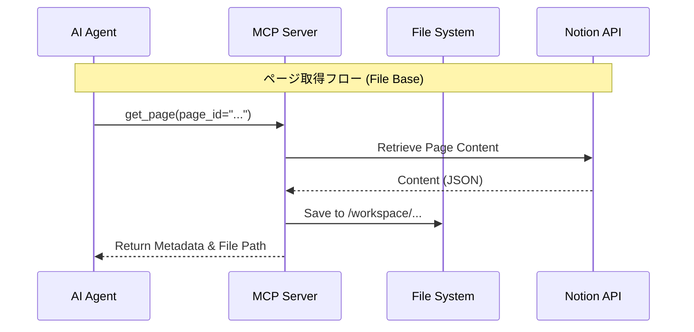

# アーキテクチャ

mcp-notionの設計思想と主要なアーキテクチャについて解説する。

## システム概要

本システムは、Notion APIをMCP (Model Context Protocol) サーバーとして提供するNode.jsアプリケーションである。
レイヤードアーキテクチャを採用し、ビジネスロジックを外部技術から独立させている。

### レイヤー構成

各層は下位層にのみ依存し、上位層への依存を持たない。

| 層 | 責務 | 具体例 |
|---|---|---|
| Presentation | 外部インターフェースとの接続 | Controller, Presenter |
| Application | ユースケースの実行 | Interactor |
| Domain | ビジネスロジック | Entities, Services, Errors |
| Infrastructure | 外部システムとの通信 | API Client, Config, Logging |

## 主な機能と設計

### ファイルベースのNotion操作（トークン節約）

LLMのコンテキストウィンドウ（トークン数）の制限を回避するため、Notionページの取得・更新にファイルシステムを介在させる仕組みを導入した。

#### 課題

通常、Notionページの全コンテンツをテキストとしてLLMに渡すと、中規模以上のページでは数千〜数万トークンを消費し、すぐにコンテキストウィンドウが溢れてしまう。

#### 解決策

* ページ取得:
    ページ内容（JSON形式）を常にローカルファイル（例: `/workspace/mcp-notion-page-...`）に保存し、LLMには「ファイルパス」と「メタデータ」のみを返却する。これにより、消費トークンを数百程度に抑えられる。
* デフォルト Extract:
    各ツールにデフォルトのextractフィールドが定義されており、AIがextractを指定しない場合に自動的に適用される。不要なデータ転送を最小限に抑える。
* ページ更新・作成 (完全ファイルベースのみ):
    LLMは更新・新規作成内容（JSON形式）をローカルファイルに書き込み、
    そのファイルパスをMCPツールに渡す(`file_path`パラメータ)。
    トークン節約を徹底するため、MCPリクエストのペイロードに直接JSONデータを
    含めることはサポートされない。サーバー側でファイルを読み込んでNotion APIを叩くため、
    リクエスト時のトークン消費は最小限に抑えられる。

### Squidプロキシによる通信制御

セキュリティを強化するため、Dockerネットワーク内にSquidプロキシを配置し、MCPサーバーからの外部通信を制御している。

* 許可された通信: Notion公式API (`.notion.so` 等) への通信のみを許可する。
* 監査ログ: プロキシへのアクセスログを記録し、予期しない外部通信が発生していないか監視可能である。
* 構成: `docker-compose.yml` にてMCPサーバーコンテナとSquidコンテナをリンクさせ、`HTTPS_PROXY` 環境変数を通じて通信を経由させる。

### エラー処理

エラーはDomain層で定義された型付きエラー（`DomainError`）として扱われ、`Result`型を用いて明示的に伝播される。

* BusinessError: 入力値不正や権限エラーなど、クライアント側に起因するエラー（4xx相当）。
* OperationalError: 外部APIのダウンや設定ミスなど、システム起因のエラー（5xx相当）。
