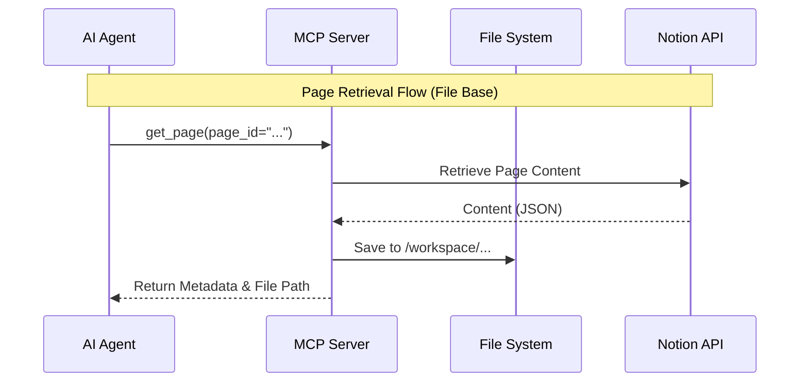

# Architecture

This document explains the design philosophy
and major architecture of mcp-notion.

## System Overview

This system is a Node.js application that provides
the Notion API as an MCP (Model Context Protocol)
server.
It adopts a layered architecture to isolate business
logic from external technologies.

### Layer Structure

Each layer depends only on the layer below it
and has no dependency on the layer above.

| Layer | Responsibility | Examples |
|---|---|---|
| Presentation | External interfaces | Controller, Presenter |
| Application | Use case execution | Interactor |
| Domain | Business logic | Entities, Services, Errors |
| Infrastructure | External systems | API Client, Config, Logging |

## Key Features and Design

### File-based Notion Operations (Token Saving)

To avoid the limitation of the LLM context window
(token count), we introduced a mechanism to intervene
with the file system for retrieving and updating
Notion pages.

#### Problem

Usually, passing the entire content of a Notion page
as text to an LLM consumes thousands to tens of
thousands of tokens for medium-sized pages or larger,
quickly overflowing the context window.

#### Solution

* Page Retrieval:
    Always saves page content (in JSON format) to a
    local file (e.g., `/workspace/mcp-notion-page-...`)
    and returns only the "file path" and "metadata"
    to the LLM. This keeps token consumption to a
    few hundred.
* Default Extract:
    Each tool has default extract fields applied
    automatically when the AI does not specify extract.
    This minimizes unnecessary data transfer.
* Page Update (specified by `file_path`):
    The LLM writes the edited content (in JSON format)
    to a local file and passes that file path to the
    MCP tool. Since the server reads the file and calls
    the Notion API, token consumption during the
    request is also minimized.

### Communication Control via Squid Proxy

To enhance security, a Squid proxy is placed within
the Docker network to control external communication
from the MCP server.

* Allowed Communication:
    Only communication to the official Notion API
    (`.notion.so`, etc.) is permitted.
* Audit Log:
    Access logs to the proxy can be recorded to
    monitor for unexpected external communication.
* Configuration:
    The MCP server container and Squid container are
    linked in `docker-compose.yml`, and communication
    is routed via the `HTTPS_PROXY` environment
    variable.

### Error Handling

Errors are treated as typed errors (`DomainError`)
defined in the Domain layer and are explicitly
propagated using the `Result` type.

* BusinessError:
    Errors caused by the client side, such as invalid
    input values or permission errors
    (equivalent to 4xx).
* OperationalError:
    Errors caused by the system, such as external API
    downtime or configuration errors
    (equivalent to 5xx).
